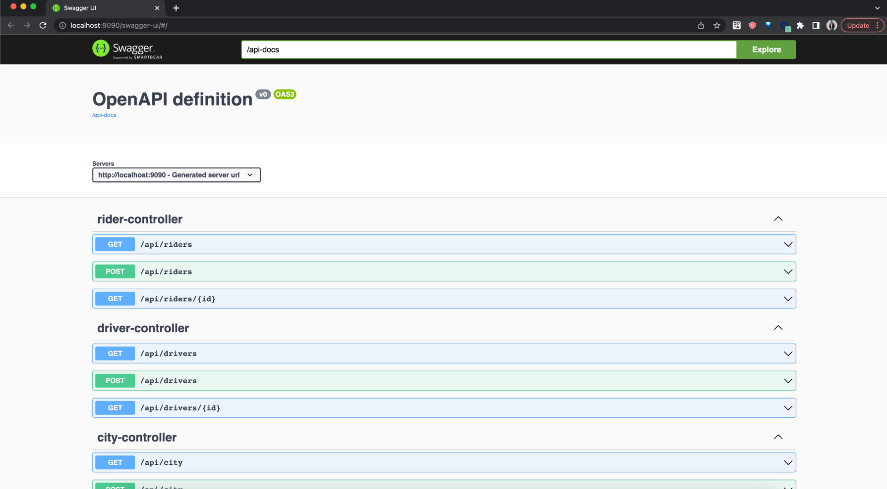

# Cab Management Portal

## About Project
Build an inter city cab management portal to be used as an admin and booking tool.

#### Expected Operations
- [x] Mercury Register cabs
- [x] Onboard various cities where cab services are provided.
- [X] Change current city (location) of any cab.
- [x] Change state of any cab. For this you will have to define a state machine for the cab ex:
a cab must have at least these two basic states; IDLE and ON_TRIP
- [x] Book cabs based on their availability at a certain location. In case more than one cab are
   available , use the following strategy;
   a. Find out which cab has remained idle the most and assign it.
   b. In case of clash above, randomly assign any cab
   Assumption : a cab once assigned a trip cannot cancel/reject it
- [x] Provide insights such as for how much time was a cab idle in a given duration ?
- [ ] Keep a record of the cab history of each cab. (A cab history could just be a record of
   what all states a cab has gone through)
- [x] Find cities where the demand for cabs is high and the time when the demand is highest

## Getting Started
#### Prerequisites
* **_JDK 8_** - Install JDK 1.8 version from [here](http://www.oracle.com/technetwork/java/javase/downloads/jdk8-downloads-2133151.html)
* **_Maven_** - Download latest version of Maven from [here](https://maven.apache.org/download.cgi)
#### Assumptions
- We stored data in memory oly for simplicity purpose but the data modules are ready to plug with doa layer
- We just build the rest end points to perform above operation assuming client will call those api's
#### Build
```
> cd phonepe-cmp  
> mvn clean compile package
```

#### Run

```
> cd phonepe-cmp  
> mvn spring-boot:run
```
### Rest End Points
The detailed api documentation you can find at this swagger [URL](http://localhost:9090/swagger-ui/#/)
API doc [here](http://localhost:9090/api-docs)


The sample json data file is available at location ```phonepe-cmp/api-json/``` import it in Postman or Insomnia api testing tool to test it.

